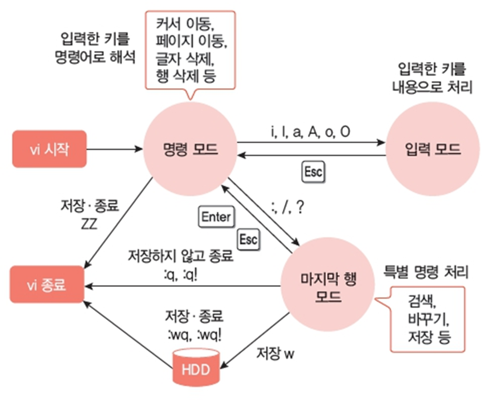
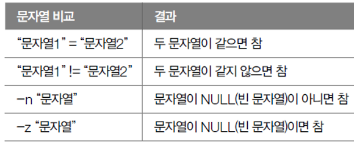

# Shell :dancer:

### 사용 명령어 요약

`cat`(concatenate)- 파일을 순서대로 읽은 후 그 내용을 읽은 순서대로 표준 출력하는 명령어

```shell 
$ cat file
$ cat file1 file2
$ cat * # 모든 파일 내용 출력
$ cat *.txt #특정 확장자 가진 파일 내용 출력
```

### 현재 linux에 설치된 shell 종류 확인하는 법

```shell
$ cat /etc/shells
$ ps --forest
$ sh
$ ps --forest
```

### Vim, Vi 에디터

* vim에서는 파일의 내용이 끝난 이후 각 행에 틸드(~) 표시
* 새로운 파일이 만들어지면 아무런 내용이 없으므로 오로지 틸드만 표시

`vi filename.txt`

* 주요 키
```shell
esc #명령 모드
i #insert, 커서 앞에 삽입
u #undo
w #단어 별 이동
G #맨 끝으로 이동
숫자 + G #해당 행으로 이동
x dw dd #delete
yw yy #copy
r cw cc #수정
p #paste
/검색어 > /ftp #search
```

### 언어 설정
* `locale` 명령어로 현재 우분투 로케일 설정 확인
* `LC-ALL`이 우선순위 가장 높다. (개별 값 변경해도 적용 X)

```shell
$ locale -a
$ export LC_ALL="C.UTF-8"
$ locale
$ export LC_ALL="ko_KR.UTF-8"
$ sudo apt update
$ sudo apt install locales
$ locale-gen ko_KR.UTF-8

$ locale
$ export LC_ALL="ko_KR.UTF-8"

docker exec -it -e LC_ALL=ko_KR.UTF-8 ubuntu /bin/bash

:set encoding=utf-8
```

### 시간대 설정
```shell
$ date
$ sudo apt-get install tzdata
$ tzselect
$ export TZ='Asia/Seoul'
$ date
```

### sh 파일 작성하기
`#!/bin/bash` - **셔뱅**, 아래 코드의 해석에 sh를 사용하겠다는 의미.리눅스 커널이 파일의 첫 부분을 확인 후 #!가 있으면 그 뒤에 적힌 명령어를 실행

`exit 0` - 명령어 실행 후 종료 코드 반환, 0-255까지 숫자 사용 가능, 자주 사용되는 상태 종료 코드가 있음 (0: 성공, 1: 알 수 없는 오류...)

### sh 파일 실행하기
```shell
$ bash test.sh
$ sh 
$ echo $?   # 종료 코드를 확인하는 명령어
$ vi test.sh # 3번째 줄의 echo "접속한 ID: " $USER 뒤에 따옴표 추가
$ sh -n test.sh # 문법 오류를 체크해주는 명령어
```

### 조건문

* **if**

```shell
if [ 조건식 ] # [ 조건 ]에서는 각 단어마다 공백 넣기
then
    수행문
elif [ 조건식 ]
then
    수행문
else
    수행문
fi
```
- 조건문 비교 연산자


* **case ~ esac**
```shell
case 기준문자열 in
 문자열1 | 문자열3)
    명령
    ;; #케이스 
 문자열2)
    명령
    ;;
 *) #else
    명령
    ;;
esac
```

### 반복문

* **while**
- 조건식이 참인 동안 계속 반복

```shell
while [ 조건 ]; do
    명령1
    ;
    명령문
    ;
done
```
* **until**
- 조건식이 **거짓**인 동안 계속 반복

```shell
until [ 조건 ]; do
    명령문
done
```
* **for**

```shell
for 변수 in 범위
do
    명령
done

#짧은 명령어는 셸에서 직접 실행 가능'
touch file{1..10}.txt
for i in {1..100}; do mv "file$i" "file_$i"; done
```